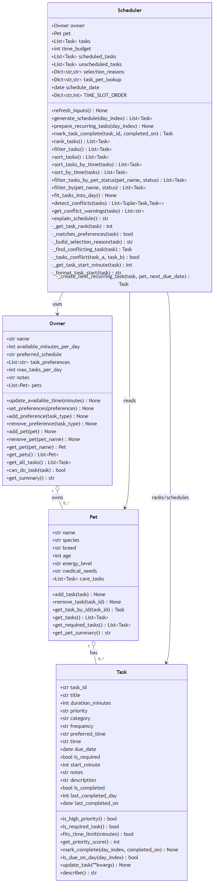

# PawPal+ (Module 2 Project)

PawPal+ is a Streamlit app I built for a pet-care scheduling project.

The idea was pretty straightforward: if someone has limited time and a bunch of pet tasks competing for attention, the app should help them decide what to do first and what can wait.

## Features

- Builds a realistic daily plan from actual constraints (not just dumping every task).
- Sorts scheduled tasks by clock time (HH:MM), so it is easy to read.
- Supports preferred time windows (morning, afternoon, evening, night, anytime).
- Flags overlapping tasks and shows conflict warnings.
- Optional advanced mode: resolves timed conflicts by moving a task to the next available slot.
- Saves owner, pets, and tasks to data.json and reloads them when the app starts.
- Lets you filter tasks by pet and status (all, pending, completed).
- Handles recurrence (daily/weekly) by creating the next due task after completion.
- Respects owner limits like total minutes per day and max tasks per day.
- Shows plain-language reasons for why tasks were selected or skipped.

## Demo

This screenshot is from the final version of the app, including task entry, schedule generation, and conflict-aware planning.

## Problem Context

The app models a common real-life situation: a pet owner has limited time, but still needs to stay consistent with feeding, walks, meds, enrichment, grooming, etc.

I organized the project in three layers:

- Class design (UML)
- Core scheduling logic in Python
- Streamlit UI for input, schedule display, and explanations

## How Scheduling Works

At a high level, the scheduler does this:

1. Pulls tasks from all pets.
2. Filters out tasks that are completed, not due, or not feasible.
3. Ranks tasks using priority, required flag, preferences, and timing fit.
4. Fits tasks into the day while respecting time/task-count limits.
5. Checks for overlaps and reports conflicts as warnings.
6. Records reasons for both scheduled and unscheduled tasks.

Advanced algorithmic option:

- The scheduler can run in next-available-slot mode.
- If a timed task conflicts, it tries to move that task forward to the nearest open slot in the same day instead of skipping immediately.
- Default behavior is unchanged (skip on conflict), so this mode is opt-in.

## How Agent Mode Was Used

I did not use Agent Mode to blindly write code.

I mostly used it like a smart pair-programmer.

First, I used it to quickly find where scheduler ranking, conflict handling, and task fitting were actually happening in the code, so I could make changes in the right place.

Then I used it while implementing the next-available-slot feature. The key decision was to keep it optional, so the original behavior still works the same unless this mode is enabled.

Finally, I used it to think through edge cases and test scenarios. After each change, I ran tests to make sure nothing else broke.

So Agent Mode definitely sped up development, but design choices and final validation still came from me.

## Quick Start

### Setup

	python -m venv .venv
	source .venv/bin/activate  # Windows: .venv\Scripts\activate
	pip install -r requirements.txt

### Run the app

	streamlit run app.py

## Testing

### Run tests

	python -m pytest tests/test_pawpal.py -v

Quick mode:

	python -m pytest tests/test_pawpal.py -q

### What is covered

The test suite currently has 85 tests across:

- Task validation and behavior
- Pet task management
- Owner constraints and preferences
- Scheduler ranking and selection
- Recurrence and conflict detection
- Time sorting and task filtering

### Current result

- 85 passed
- 0 failed
- 0 skipped

## Project Files

- pawpal_system.py: data models and scheduling logic (Owner, Pet, Task, Scheduler)
- app.py: Streamlit interface
- tests/test_pawpal.py: test suite
- uml_final.mmd: final Mermaid UML source
- uml_final.png: exported UML image

## Notes and Limits

- The current design assumes a single owner session.
- Conflict detection depends on explicit timing (time or start_minute).
- The scheduler is intentionally lightweight and explainable, not a full optimization engine.

